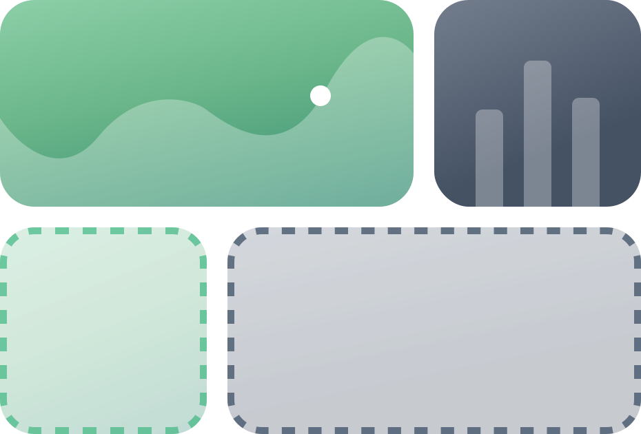
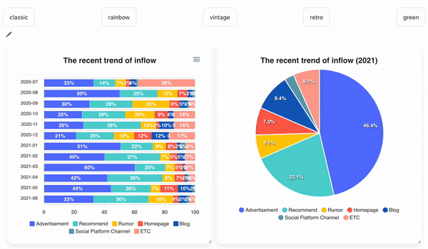

<p align="center">
  <a href="https://github.com/medistream-team/vuetiful-board" target="_blank">
    
  </a>
</p>

<h1 align="center">💐 Vuetiful-Board</h1>


<h3 align="center">A Beautiful Chart Using Draggable Grid For Vue.js</h3>

<p align="center">


</p>

# Documentation
👉🏻 [Please Click Here!](https://medistream-team.github.io/vuetiful-board/)

# Table of contents

- [Installation](#Install)
- [Usage](#Usage)
- [Properties](#Properties)
- [Explanation](#Explanation)
- [Features](#Features)
- [Contributors](#Contributors)

# Install
```sh
npm install vuetiful-board
```

```javascript
import VuetifulBoard from 'vuetiful-board'

Vue.use(VuetifulBoard)
```

-----


# Usage

```javascript
  <vuetiful-board
    :theme="classic"
    :dark-mode="true"
    :col-num="12"
    :row-height="30"
    :layout-editable="true"
    :datasets="[
      {
          chartInfo: {
            series: [200, 12, 40, 25, 34, 6, 23],
            options: {
              chart: {
                type: 'pie',
              },
              title: {
                text: 'The recent inflow route',
                align: 'center',
                style: {
                  fontSize: '18px',
                  fontWeight: 'bold',
                },
              },
              labels: [
                'SNS',
                'Recommend',
                'Homepage',
                'Blog',
                'Kakaotalk Channel',
                'Rumor',
                'ETC',
              ],
              fill: {
                opacity: 1,
              },
              legend: {
                position: 'bottom',
              }
            }
          },
          gridInfo: {
            x: 6, y: 0, w: 6, h: 12, i: '1', static: false
          },
        },
    ]"
  />
```


-----

# Properties


## 🖼 Grids


### colNum

<li>type:  <code>Number</code></li>
<li>required: <code>true</code></li>
<li>default: <code>12</code></li>

<br>

Says how many columns the grid has.


The value should be a <strong>natural number.</strong>

<br>

### rowHeight


<li>type:  <code>Number</code></li>

<li>required: <code>true</code></li>

<li>default: <code>30</code></li>

<br>

Says what is a height of a single row in pixels.

The value should be a <strong>natural number.</strong>

<br>

### layoutEditable

<li>type:  <code>Boolean</code></li>
<li>required: <code>true</code></li>
<li>default: <code>true</code></li>

<br>

Says when to decide whether to edit the layout.


The default value is true, and layout editing is basically possible. <br>
And if the default is changed to false, layout editing becomes impossible.

---

## 📊 Charts

### datasets

<li>type:  <code>Array</code></li>
<li>required: <code>true</code></li>
<li>default: <code>true</code></li>


<br>

This is where you have to enter the direct data you will use. <br>
Dataset requires <strong>basic information on charts</strong> and <strong>elements related to grids.</strong>

Datasets basically takes this form. 
```javascript

datasets: {
  chartInfo: {},
  gridInfo: {}
}

```


If no content is entered into the dataset, a basic chart form with no information will appear.


<br>

### theme

<li>type:  <code>[String, Array]</code></li>
<li>default: <code>'classic'</code></li>


<br>

Use it if you want to change the theme of the chart fluidly.<br>
Basically, there are five themes provided: classic, retro, green, vintage, and rainbow.<br>


As in the example below, a <strong>color palette</strong> may be set as desired.
<br>
If you want to use color palette for theme, you can refer this page [palette.json](https://github.com/medistream-team/vuetiful-board/blob/master/src/assets/palette.json)

```json

[
  {
    "name": "classic",
    "colors": [
      "#5975fe",
      "#54d2d2",
      "#ffcb00",
      "#ff6150",
      "#1360bf",
      "#62a1b3",
      "#ffa395",
      "#b37268",
      "#5cd184",
      "#ffff00"
    ]
  },
  {
    "name": "rainbow",
    "colors": [
      "#e74645",
      "#fb7756",
      "#facd60",
      "#38ada9",
      "#1e3799",
      "#6a4fa5",
      "#faa3ba",
      "#ffc145",
      "#264e70",
      "#679186"
    ]
  },
  {
    "name": "vintage",
    "colors": [
      "#004e89",
      "#6b51a4",
      "#fcba04",
      "#a50104",
      "#590004",
      "#3867d6",
      "#3cbbb1",
      "#fab1a0",
      "#fdcb6e",
      "#4b6584"
    ]
  },
  {
    "name": "retro",
    "colors": [
      "#38e0ec",
      "#5b9279",
      "#8fcb9b",
      "#324376",
      "#8f8073",
      "#dd614a",
      "#fa824c",
      "#6b6ed1",
      "#f7c548",
      "#63d2ff"
    ]
  },
  {
    "name": "green",
    "colors": [
      "#277f8e",
      "#77AD78",
      "#365c8d",
      "#4ac16d",
      "#46337e",
      "#9fda3a",
      "#3867d6",
      "#440154",
      "#1fa187",
      "#4b6584"
    ]
  }
]

```


<br>

### monochrome

- type: `Object`
- default: ```{
  enabled: false,
  color: '#255aee',
  shadeIntensity: 0.65
}```

When monochrome is enabled, it takes precedence over the theme.

### darkMode

<li>type:  <code>Boolean</code></li>
<li>default: <code>false</code></li>


<br>

Says if you want to set the dark mode (switch effect of background and font color).

----


# Explanation

## Chart

📊 You can easily create variable charts.

### series


This contains the direct data essential for the chart. You can specify the type or name of each chart data.


```javascript
//Example
series: [
          {
            name: 'Women',
            data: [25, 30, 64, 57, 50]
          },
          {
            name: 'Men',
            data: [30, 27, 56, 39, 70]
          }
        ],

        ...
```

### options

<br>

This determines the shape of the chart and includes style elements such as the title or font size of the chart.

Vuetiful-board basically follows the internal configuration of apexchart. <br>Therefore, please refer to this page if you want more detailed information. [apexchart](https://apexcharts.com/)

<br>

```javascript
//Example
options: {
          chart: {
            type: 'line',
          },
          title: {
            text: 'Growth Rate',
            align: 'center',
            style: {
              fontSize: '20px',
              fontWeight: 'bold',
            },
          },

          ...
```

## Grid

🖼 You can easily create a dragable and resized grid.

### x

<br>This means the initial horizontal position of the item (as to which column to be placed).
<br>The value must be a <strong>number.</strong>

### y

<br>This means the initial vertical position of the item (in which row to be placed).
<br>The value must be a <strong>number.</strong>

### w

<br>This refers to the initial width of the item.


### h

<br>This refers to the initial height of the item.

### i

<br>This each serves as a unique identifier for grid items. 
<br>The value must be a <strong>string</strong> and not overlap.


### static

<br>This determines whether to modify (draggable & resize) the item. <br>If you want the item to be fixed, it should be false, otherwise, it should be true.


```javascript
//Example
x: 0, y: 0, w: 6, h: 12, i: '0', static: false
```

----

# Features

## Drag & Drop / Resize

<br>

Vuetiful-board supports drag & drop and resize functions. <br>You can drag it in the desired direction and adjust the size freely.

```javascript
:layout-editable="layoutEditable"
```

<br>


<br>
<br>

## Color Theme

<br>

Vuetiful-board can specify the theme color. <br>You can freely decorate the chart with the color theme of the palette you want.

<br>

If you're curious about how to designate a pallet, please refer to this page. [properties](/property)

```javascript
:theme="theme"
```
```javascript
switchTheme(themeName) {
      this.theme = themeName;
    },
```

<br>




<br>
<br>

## Dark Mode

<br>

Vuetiful-board supports dark mode. <br>When dark mode is selected, both the chart, grid, and background colors become dark, and the font color is reversed to white.

```javascript
:dark-mode="darkMode"
```

<br>


<br>
<br>

## MonoChrome

<br>

Vuetiful-board can be painted with monochrome. <br>When monochrome is selected, the chart color changes to saturation and brightness of the corresponding color.

```javascript
setMonochromeColor(event) {
      this.monochrome = {
        enabled: true,
        color: event.target.value,
      }
    },
```

<br>


-----

# Contributors

- [medistream](https://github.com/medistream-team)
- [hayoung](https://github.com/iamhayoung)
- [jihyun](https://github.com/hxyxneee)

-----

# 📝 License

Copyright © 2021 [Medistream](https://github.com/medistream-team)<br />
This project is [MIT](https://github.com/medistream-team/vuetiful-board/blob/master/LICENSE) licensed.
